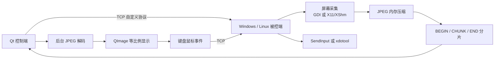

# 跨平台远程桌面控制系统｜秋招项目速览

## 项目定位

这是一个使用 **C++17、Qt 6、TCP、Win32/GDI 和 X11/XShm** 实现的跨平台远程控制项目。

Windows 和 Linux 均可作为控制端或被控端。用户只需启动统一中文 Qt 应用，即可连接其他设备，同时在后台自动运行本机被控服务。

项目重点不是复刻成熟商业远控软件，而是完整实践：

- TCP 应用层协议设计与流式解析。
- 跨平台桌面采集和输入注入。
- JPEG 内存编解码和画面分片传输。
- GUI 事件循环与后台图像任务协作。
- 心跳、断线重连和资源生命周期管理。
- Windows/Linux 构建、打包与端到端验证。

## 当前效果

| 控制端 | 被控端 | 当前验证状态 |
| --- | --- | --- |
| Windows Qt | Windows | 公网双机画面和键鼠控制通过 |
| Windows Qt | Linux | 协议握手和心跳通过 |
| Linux Qt | Windows | TCP 会话建立 |
| Linux Qt | Linux | TCP 会话建立 |

> Linux 原生 Wayland 控制尚未实现；Linux 端当前主要面向 X11。

## 系统结构



Qt 应用保留原生服务端作为独立进程：

```text
remote_control
├── 控制其他设备：QTcpSocket + 远程画面 + 键鼠事件
└── 允许远程控制：QProcess 自动管理平台服务端
    ├── Windows：win_server.exe
    └── Linux：linux_server
```

这样既复用已经验证的底层代码，也让用户只需要启动一个程序。

## 新增 Qt 功能

### 统一中文界面

- “控制其他设备”和“允许远程控制”双页签。
- 中文连接状态、错误提示、重连状态和服务日志。
- 自动保存上次连接地址与端口。
- 应用启动时自动运行本机服务端。

### 事件驱动网络连接

- 使用 `QTcpSocket` 接入 Qt 事件循环。
- 使用增量缓冲区处理 TCP 粘包、半包和一次多包。
- 使用 `QTimer` 实现心跳检查和自动重连，不阻塞 GUI。
- 显式设置 `QNetworkProxy::NoProxy`，保证原始 TCP 私网直连。

### 后台画面解码

- 使用 `QtConcurrent` 在线程池中完成 JPEG 解码。
- 使用 `QFutureWatcher` 把完成结果交回 GUI 线程。
- 使用单槽位“最新帧覆盖”，避免弱网下历史画面在应用层持续堆积。
- 使用自定义 `QWidget` 和 `QPainter` 等比例绘制，黑边不拉伸画面。

### 远程键鼠控制

- 支持移动、按下、抬起、双击、滚轮和常用键盘按键。
- 根据实际画面显示区域映射远程坐标，黑边区域不发送事件。
- 鼠标移动约 20 ms 节流并过滤重复坐标。
- 记录已按下按键和按钮，窗口失焦或暂停控制时主动释放，降低远端卡键风险。

## 协议与实时性设计

基础协议格式：

```text
magic | cmd | body_len | body
```

屏幕帧使用：

```text
SCREEN_BEGIN(frame_id, width, height, total_size, format)
SCREEN_CHUNK(frame_id, offset, data_len, data)
SCREEN_END(frame_id)
```

客户端只有在帧号、分片偏移、累计长度和结束帧号全部匹配后才解码，残缺 JPEG 不会进入显示流程。

连接管理：

- 空闲 3 秒发送心跳。
- 10 秒未收到完整有效消息则关闭会话。
- 断线后按 `1s → 2s → 4s → 8s` 指数退避重连。
- 原生服务端断开后返回 `accept`，继续等待下一次连接。

## 关键问题与解决方式

### Qt 客户端无法连接私网地址

原生 TCP 可以连接，但 Qt 路径失败。通过分层排查确认监听和网络可达后，把问题定位到 Qt 网络代理配置。为 `QTcpSocket` 设置 `NoProxy` 后恢复直连。

### 鼠标移动事件被误判为重复

初版在重复判断前更新了上一次远程坐标，导致当前点永远等于“上一点”。调整为事件发送后再更新坐标，并增加移动节流。

### 公网画面出现明显延迟

完整桌面 JPEG 持续进入单条 TCP 流后可能排队，心跳也会受到队头阻塞影响。当前使用 JPEG 压缩、分阶段耗时日志和客户端最新帧覆盖进行第一阶段优化；服务端背压、动态帧率和视频编码仍是后续方向。

### Qt 与 MinGW 工具链不匹配

系统 MinGW 版本与 Qt 预编译库不一致时会链接失败。Windows 构建固定使用 Qt 安装包匹配的 MinGW 工具链，并使用独立构建目录避免旧缓存污染。

### Ubuntu Qt 版本兼容

Ubuntu 22.04 的 Qt 6.2 缺少较新版本的 `qt_standard_project_setup`。CMake 使用能力检测，在旧版本中回退到 `AUTOMOC/AUTOUIC/AUTORCC`。

### Linux Qt 默认进入 Wayland

当前底层依赖 X11/XShm 和 `xdotool`。Linux 在用户未显式指定平台时默认选择 Qt xcb 后端，使界面和输入链路保持一致。

## 量化结果

- 1920×1080 BGRA 原始单帧约 `8.29 MB`。
- quality 75 JPEG 实测常见约 `0.14～0.25 MB`。
- Windows Qt → Linux server 本机跨平台心跳 RTT 约 `1 ms`。
- Windows 公网双机测试完成画面显示和键鼠控制。
- Windows/Linux 两个平台完成统一 Qt 应用和原生服务端构建。

## 工程化实践

- 使用 `std::vector<char>` 管理协议编码缓冲区，替代手动 `malloc/free`。
- 使用不可复制、可移动的 `SocketHandle` 管理原生 socket。
- 会话结束采用 `shutdown → join → close`，避免屏幕线程继续使用已关闭句柄。
- 固定宽度协议字段配合 `static_assert` 检查关键结构大小。
- 按提交拆分连接、画面、输入、统一应用、打包和验证，保留调试演进记录。
- 提供 Windows x64 便携包和 Ubuntu 22.04 amd64 安装包构建流程。

## 技术栈

```text
C++17 / STL / 多线程
Qt 6 Widgets / Network / Concurrent
TCP Socket / WinSock / POSIX Socket
Win32 API / GDI / SendInput
X11 / XShm / xdotool
stb_image / stb_image_write
CMake / Ninja / MinGW / GCC / Git
```

## 当前限制

- 尚未加入身份认证、授权和传输加密，不适合直接作为生产公网工具。
- 当前协议仍是固定结构直接序列化，缺少网络字节序转换和版本协商。
- 画面使用完整 JPEG 帧，没有差分编码、码率控制或视频编码。
- Linux 输入主要支持 X11，不支持原生 Wayland。
- 当前按单客户端会话设计。
- Linux 实体机的完整画面与键鼠回归仍需继续补充。

## 后续计划

1. 增加认证、会话密钥和加密传输。
2. 增加发送背压、动态帧率和动态 JPEG 质量。
3. 拆分控制与画面通道，降低输入被大帧阻塞的影响。
4. 评估变化区域、H.264/AV1 或低延迟流媒体方案。
5. 增加多显示器、剪贴板和文件传输。
6. 建立 GitHub Actions 四端构建和 Release 自动发布。

## 阅读入口

- [完整 README](../README.md)
- [修改日志](../CHANGELOG.md)
- [四端验证记录](qt-four-end-test.md)
- [Qt 公网画面测试](qt-screen-test.md)
- [Qt 公网键鼠测试](qt-input-test.md)

